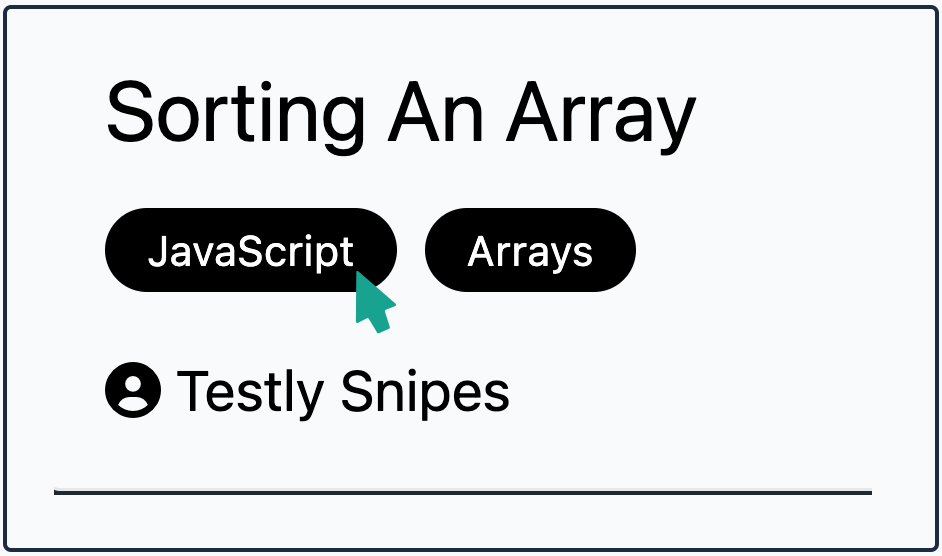

# SnipNest <!-- omit from toc -->


- [Project Outline](#project-outline)
- [Technologies](#technologies)
- [Installation](#installation)
- [Key Features](#key-features)
  - [Search](#search)
  - [Tags](#tags)
  - [User Operations](#user-operations)
  - [CRUD Operations](#crud-operations)
- [Security](#security)
- [Database Integrity](#database-integrity)
- [Testing](#testing)
- [Prospective Improvements](#prospective-improvements)
---

## Project Outline
A PHP/Laravel web app that acts as a user-submitted repository for code snippets, within a sharing and social environment. CRUD operations have two scopes:
- Users
  - Register user
  - Log In
  - Log Out
- Snippets
  - Post snippet
  - View all snippets
  - View individual snippet
  - View logged-in user's listings
  - Update logged-in user's listings
  - Delete logged-in user's listings

## Technologies
- PHP
- Laravel
- Blade
- MySQL
- Tailwind
- JavaScript
- Bcrypt
- Composer

## Installation
- This project was developed on XAMPP. To download and run it:
  - Make sure you have XAMPP installed
  - Make sure you have Composer installed

- To view the project locally, you need to set up a local Virtual Host. 
  - Find the hosts file (Windows - `C:/Windows/System32/drivers/etc/hosts`. Mac - `/etc/hosts`)
  - Add these lines: 
    - `127.0.0.1	localhost`
    - `127.0.0.1	PROJECT_NAME.test`
- Edit Virtual Hosts File
  - Windows: `C:/xampp/apache/conf/extra/httpd-vhosts.conf`
    - Add the following:
    ```
    <VirtualHost *:80>
      DocumentRoot "C:/xampp/htdocs"
      ServerName localhost
    </VirtualHost>

    <VirtualHost *:80>
      DocumentRoot "C:/xampp/htdocs/PROJECT_NAME/public"
      ServerName PROJECT_NAME.test
    </VirtualHost>
    ```


## Key Features
### Search
The search bar will return results with matching tags, titles and descriptions.

### Tags
Tags can be clicked to use them as keyword filters.


### User Operations
All users can view posts by other users, but to access CRUD capabilities users must register and log in. They are also able to log out. 

### CRUD Operations
Once a user has registered them can create, edit and delete their posts. They can also view all their own posts on one page. 


## Security
- `create.blade.php` holds the form to submit new code snippets. `@csrf` tops the form to disallow Cross Site Scripting
- Data sanitisation is handled by `ListingController.php`. Data types are enforced and file uploads are restricted by file type (jpg, png, gif).
- Bcrypt hashes user passwords on registration.
- Laraval's in-built sanitisation automatically removes any script tags in text inputs, and Blade templates escape output by default.

## Database Integrity
- To ensure User-submitted data is accurate, consistent, and reliable, the `store()` and `update()` functions in `ListingController` enforces data constraints. All fields are required and must adhere to correct formatting.
- Each form input field has `@error('input')` tags to inform users which fields are producing errors

## Testing
To test the app, I created a factory and generated fresh fake user and listing data with Faker, using the `php artisan migrate:refresh --seed` command. This command also refreshed my database tables.

## Prospective Improvements
- In a future iteration of this project users should be able to rate and comment on snippet postings, further enhancing the community aspect of the site.
- Snippet postings show the name of the user who posted them. In a future iteration this should become a link to a profile page for that user listing all their posts.